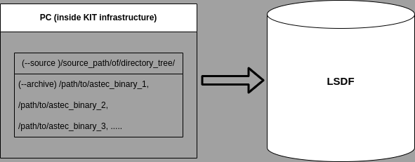

<div align="center">
    <a href="https://assas-horizon-euratom.eu/"></a>
</div>

----

# ASSAS Data Hub

The ASSAS Data Hub is a web application to store and visualize ASTEC simulation data on the Large Scale Data Facility at KIT. Its database contains the ASTEC archive in binary raw format and offers a conversion in other data formats. At the moment only a conversion in hdf5 data format is supported.

- [Prequisites](#prequisites)
- [Installation](#installation)
- [Upload ASTEC Data](#upload-astec-data)
- [Database View](#database-view)
- [RESTful API](#restful-api)

## Prerequisites

The ASSAS Data Hub is a flask web application, which requires the following additional software packages:

* [MongoDB Version 7.0.6](https://www.mongodb.com/docs/manual/release-notes/7.0/)
* [Python3.11 virtual environment](https://docs.python.org/3/library/venv.html)
* [ASTEC V3.1.1 installation](https://gforge.irsn.fr/?lang=en#/project/astec/frs/7574/details)
* [Cron 1.5.2](https://wiki.ubuntuusers.de/Cron/)

## Installation

### Start application

Entrypoint of the application is wsgi.py (Python Web Server Gateway Interface) and can be started with:

```console
$ python wsgi.py
```

The application starts as a custom flask app. Test version available under [http://assas.scc.kit.edu:5000/assas_app/home](http://assas.scc.kit.edu:5000/assas_app/home) on a virtual machine inside the KIT infrastructure.

### NoSQL Database

Runs on ``CONNECTIONSTRING = r'mongodb://localhost:27017/'``.

Restart NoSQL Database:

```console
$ service mongod restart
```

### Mount lsdf share

The following command mounts the LSDF on the server system for the user ``USER``:

```console
$ sudo mount -t cifs -o vers=2.0,username='USER',uid=$(id -u),gid=$(id -g) //os.lsdf.kit.edu/kit/scc/projects/ASSAS /mnt/ASSAS
```

### Reverse-proxy configuration

## Upload of ASTEC data

The upload of ASTEC data is supported through an upload application under ``tools/assas_data_uploader.py``.  

### Required Access and Configuration

The use of the upload application requires the following:

1. Request of a Partner- and Guest-KIT Account ([https://www.scc.kit.edu/en/services/gup.php](https://www.scc.kit.edu/en/services/gup.php))
2. Access to the LSDF with this Account ([https://www.lsdf.kit.edu/](https://www.lsdf.kit.edu/))
3. Configure a password-less ssh login to the login server of the LSDF ([https://www.lsdf.kit.edu/docs/ssh/#using-ssh-on-linux-or-mac-os](https://www.lsdf.kit.edu/docs/ssh/#using-ssh-on-linux-or-mac-os)). The password-less configuration is mandatory to perform the upload. The application will not start without a password-less configuration.
   Create a new key pair ``key`` and ``key.pub`` with the following command:
   ```console
   $ ssh-keygen
   ```
   This command creates a key pair at the same location of command execution. The generated key pair has to be used for the next commands. Please check that the path to the key is correct. Transfer the public key to the login server of the LSDF with the following command:
   ```console
   $ ssh-copy-id -i ./key.pub <USERNAME>@os-login.lsdf.kit.edu
   ```
   Add the private key as idenitiy on the local machine in executing the following command:
   ```console
   $ ssh-add ./key
   ```
   Please test the password-less configuration before continuing with the next steps by executing the command:
   ```console
   $ ssh <USERNAME>@os-login.lsdf.kit.edu
   ```
   This command should open the terminal to the LSDF without asking for a password.
4. Installation of ``Python3.10+`` and ``rysnc`` on the local machine ([https://www.python.org/downloads/](https://www.python.org/downloads/) and [https://wiki.ubuntuusers.de/rsync/](https://wiki.ubuntuusers.de/rsync/))
5. Definition of the upload parameters of the ASTEC archive according to the commandline interface described in the next section

### Commandline Interface

The commandline interface of the upload application requires the following parameters:

* --user (-u): KIT internal batch which has access to the LSDF
* --source (-s): Path to the directory tree which will be uploaded (ASTEC Project directory)
* --name (-n): Corresponding name of the archive visible in the database
* --description (-d): Corresponding description of the archive visible in the database
* --archives (-a): Sub path to the actual ASTEC archive inside the directory tree, or a list of sub paths

The commandline interface of the upload application has the following optional parameter:

* --uuid (-i): Upload identifier of an upload process which was already started

Note: This parameter can be used to resume an interrupted or failed upload. One must determine the upload uuid from the standard output of the upload application. 

### Examples

The upload application can be executed via commandline as follows:

```console
$ python tools/assas_data_uploader.py -u my_user -s my_source_path -n my_name -d my_description -a my_archive_path
```

If there is a project tree with several ASTEC runs, one can define a list of archive paths:

```console
$ python tools/assas_data_uploader.py -u my_user -s my_source_path -n my_name -d my_description -a my_archive_path_1, my_archive_path_2, ....
```

<div align="center">
    </img>
</div>

## Database view

The database view displays a list with all available datasets and provides the following parameters:

* ``Index``: Unique index of dataset
* ``Size``: Size of ASTEC binary archive
* ``Size hdf5``: Size of the hdf5 file after conversion
* ``Date``: Date of the upload time
* ``User``: User which has uploaded the dataset
* ``Status``: Status of the uploaded dataset
* ``Name``: Given name of the uploaded dataset

By click on the column cell ``File`` the user can download the hdf5 file.  

By click on the parameter ``Name`` the user comes to a detailed view with following meta information about the dataset.

### General

* Name (same as on the database view)
* Description

### Data

The following meta information is extarcted during the upload and conversion process:

* Variables: List of extracted variables
* Channels: Number of ectracted channels
* Meshes: Number of extracted meshes
* Samples: Number of extracted samples

## RESTful API

The ASSAS Data Hub provides a RESTful API to query training data in an automated way.

### Read data

## Writing data

---

<div align="center">
    <a href="http://www.kit.edu/english/index.php"></a>
</div>